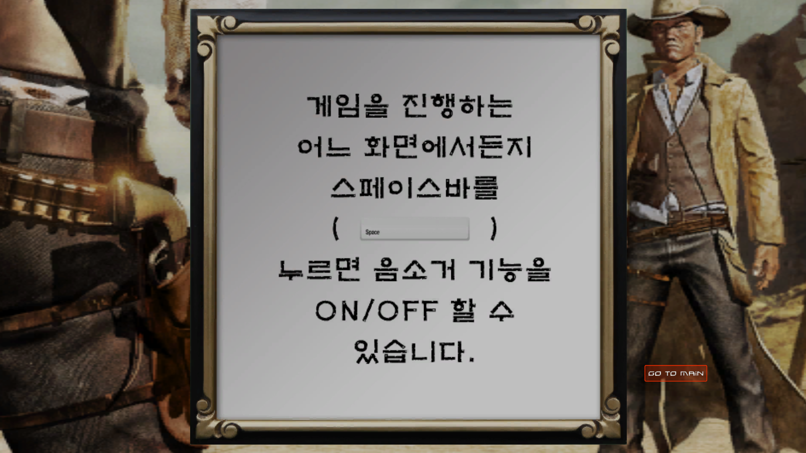
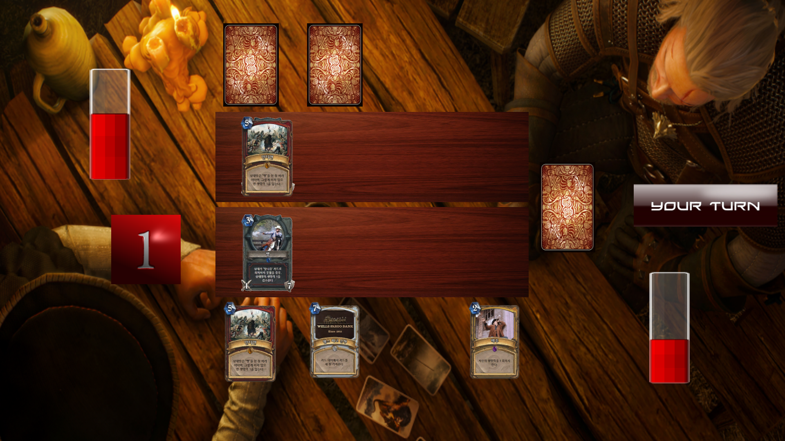
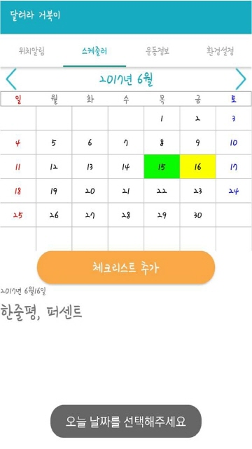
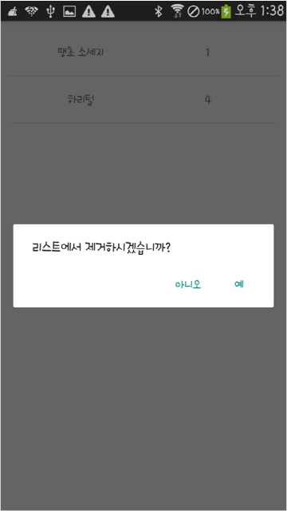
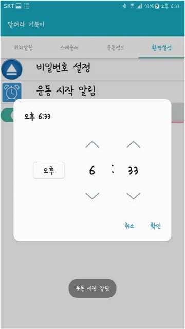
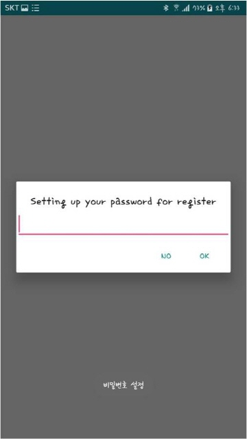

# My-Portfolio-Web
- 개발인원 : 1명
- 역할
  - 전체
  
## Introduction
직접 구현해 본 저의 포트폴리오 웹사이트입니다.

HTML과 CSS로 레이아웃을 구성하고 JavaScript와 jQuery를 이용해 기능을 구현한 후 php를 이용해 MySQL과 연동하여 데이터베이스를 구축했습니다. 

최종적으로 닷홈 호스팅 서버에 올려 외부에서 접속할 수 있도록 했습니다.

## Development Environment
- TextEditor : Sublime Text 3
- Language : HTML, CSS, JavaScript(jQuery), php
- Server : 닷홈 호스팅 서비스
- FTP : FileZilla
- DB : MySQL, phpMyAdmin 

## Code Preview
***JavaScript를 이용한 innerHTML 전환***
```html
<li class="aside-listText"><p><a href="javascript:workChange(1);">역할 카드게임 'WANTED'</a></p></li>
<li class="aside-listText"><p><a href="javascript:workChange(2);">GPS를 활용한 운동관리 어플리케이션</a></p></li>
```
```JavaScript
// 선택한 작품에 맞는 작품 설명 페이지 호출 함수
function workChange(idx) {
	var strHTML = "";
	var activitySection = document.getElementById("work-section");

	switch (idx) 
	{
		// WANTED
		case 1:
		strHTML += "<h2>Unity엔진과 C#으로 구현한 카드배틀게임</h2>";
		strHTML += "";
		strHTML += "";
		strHTML += "";
		strHTML += "";
		strHTML += "";
		strHTML += "";
		strHTML += "";
		activitySection.innerHTML = strHTML;
		break;
		
		// 운동관리 어플
		case 2:
		strHTML += "<h2>GPS를 활용한 종합 운동관리 안드로이드 앱</h2>";
		strHTML += "&nbsp";
		strHTML += "<br>";
		strHTML += "&nbsp";
		strHTML += "<br>";
		strHTML += "&nbsp";
		strHTML += "<br>";
		strHTML += "";
		activitySection.innerHTML = strHTML;
		break;
 ```

## Screenshots
